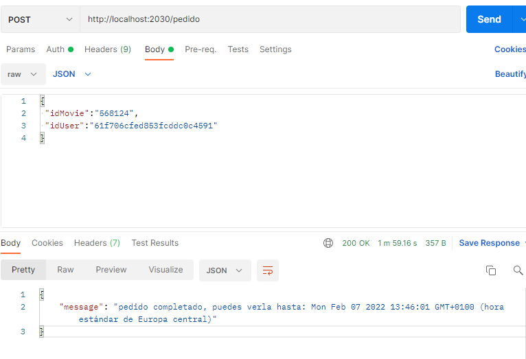

# proyecto-backend-api-movie
proyecto de api movies con backend

&nbsp;

[Repositorio](https://github.com/Saya85/proyecto-backend-api-movie.git)


## Tecnologias y recursos
***
Tecnologias utilizadas 
* [MongoDB](https://cloud.mongodb.com/)(Base de Datos)
* [Postman](https://www.postman.com/downloads/) 
* [api](https://api.themoviedb.org/3/movie/popular?api_key=cea68b520beecac6718820e4ac576c3a)
* [Java-Script](Json)
* [express](~4.16.1)
* [bcrypt](^5.0.1) 
* [body-parser](^1.19.1)
* [cookie-parser](~1.4.4)
* [dotenv](^14.3.2)
* [jsonwebtoken](8.5.1)
* [mongoose](^6.1.8)
* [morgan](~1.9.1)
* [debug](~2.6.9)

&nbsp;

## Partes de los modulos y rutas.

primero hay que  instalar las dependencias con yarn install

[modulos]
cree 3 modulos: UserModels, moviesModels y PedidosModels

[moviesModels] hay la api de pelicuals creada mas las funciones que despues las mada la ruta movies.js donde alli ejecutara todas las estancias indicadas.

[UserModels] creo las funciones que son para los usuarios y subirlas al bakend en users.js (este modulo fue contribucion de nuestro tutor)

[PedidosModels] en este modulo hacemos las funciones de los pedidos y lo mandamos al pedidos.js para que lo suba al backend

### Pruevas ejecucion.

- crear usuario (POST:/users/register)


- login usuario (POST:/users/login)


- usuario por id (POST:/users/:id)


- delate usuario (POST:/users/:id)


- Mostrar peliculas (GET:/movies)


- Mostrar pelicula por id (GET:/movies/id/:id)


- Mostrar pelicula por titulo (GET:/movies/titulo/:title)


- Mostrar pelicula por titulo (GET:/pedido)


## Instalación 🔧
***
Para descargar el repositorio a tu maquina local, obten la URL del repositorio y utlizando la terminal pon este comando:

```
git clone "URL_REPOSITORIO"
```
entramos en el repositorio y hacemos un *npm install* en la terminal de bash 
``` 

&nbsp;


## Autores ✒️
***
* **Saya Casino Vidal** - *Trabajo Inicial y Documentación* - [Saya85](https://github.com/Saya85)
&nbsp;


## Licencia 📄

Este proyecto está bajo Licencia.

